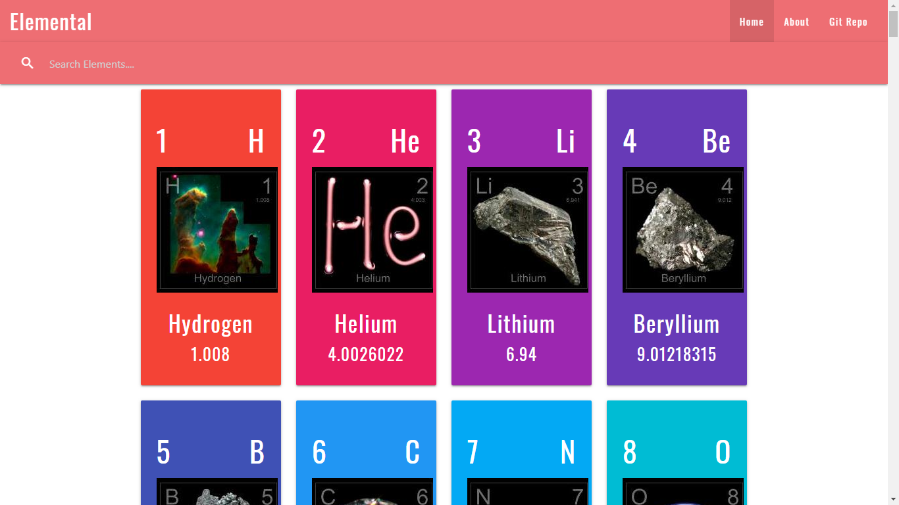
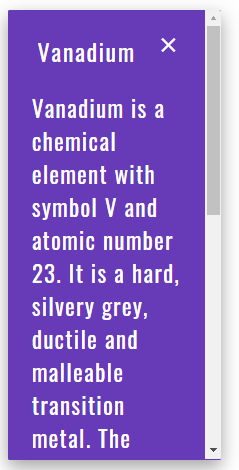
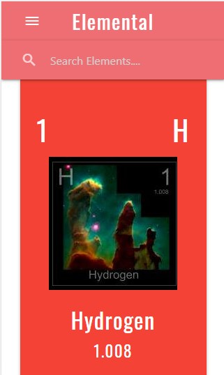
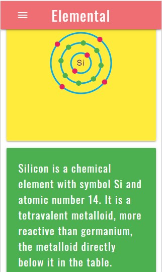

# Elements
Information about all the elements in a beautiful UI made with React and Materialize using Chemistry API
## See Live
Its available to see live at <https://ashutoshagrawal2004.github.io/Elements/>
## Installation 
Clone the repo and run
```node
npm install
npm start
```
### Learn More

You can learn more in the [Create React App documentation](https://facebook.github.io/create-react-app/docs/getting-started).

To learn React, check out the [React documentation](https://reactjs.org/).


## Demo Images
### Desktop
#### Home


#### Real Time Search

#### Quick Summary


#### Detail Page

#### About Page

## It's Completely Responsive
### Mobile




### Tablet


